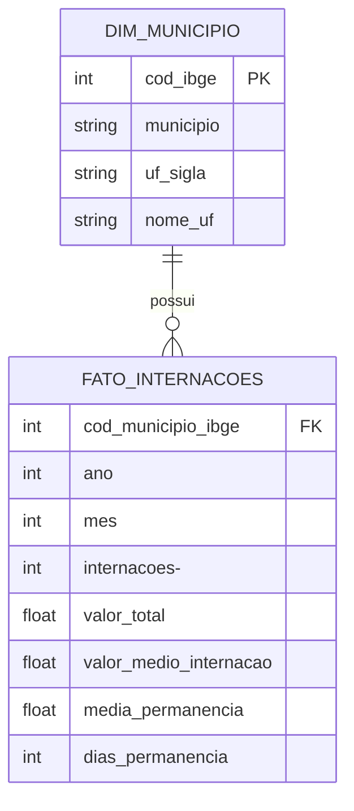

<<<<<<< HEAD
# 📊 Análise de Internações Hospitalares no Brasil (2019–2025)

---

## 📌 Visão Geral

Este projeto realiza o processamento, modelagem e análise de **dados públicos de saúde** no Brasil, integrando informações do **DATASUS (SIH/SUS)** e do **IBGE**.

O foco é transformar dados brutos governamentais em **insights analíticos**, permitindo compreender o comportamento das internações hospitalares entre **2019 e 2025**, com ênfase em volume, custos, permanência hospitalar e sazonalidade.

---

## 🎯 Objetivos do Projeto

- 🔧 **Engenharia de Dados:** ETL completo de dados governamentais
- 🧱 **Modelagem Analítica:** Estruturação em modelo dimensional (Star Schema)
- 📊 **Análise Exploratória:** Custos, volume, eficiência hospitalar e padrões temporais
- 💼 **Portfólio Profissional:** Demonstração prática de Python, SQL e Analytics

---

## 🏗️ Arquitetura e Pipeline ETL

### 🔄 Pipeline de Dados (Python + Pandas)

Os dados do TabNet/DATASUS possuem estrutura **wide (larga)**, com colunas por mês/ano.  
Foi desenvolvido um pipeline de **ETL em Python** para:

1. **Extração**
   - Importação de arquivos `.csv` do DATASUS (SIH/SUS)
   - Integração com códigos geográficos oficiais do IBGE

2. **Transformação**
   - Limpeza de rodapés e colunas inválidas
   - Conversão de formato *Wide → Long* (`melt`)
   - Padronização de datas (ano/mês)
   - Normalização de códigos IBGE

3. **Carga**
   - Persistência em banco de dados **SQLite**
   - Estrutura otimizada para consultas analíticas em SQL

---

## 🧱 Modelo de Dados – Star Schema

O projeto utiliza **modelagem dimensional**, ideal para análises analíticas e BI.

## 🔍 Principais Análises e Insights

### 📈 Evolução das Internações
- Queda significativa em **2020**, associada à pandemia e suspensão de procedimentos eletivos
- Recuperação progressiva a partir de **2021**
- **2024** apresenta o maior volume de internações da série histórica

### 💰 Concentração de Custos
- Capitais e polos regionais concentram o maior custo total
- Estados do **Sul e Sudeste** apresentam maior *ticket médio* por internação

### 📆 Sazonalidade
- Menor volume de internações em **fevereiro** e **dezembro**
- Estabilidade e leve alta no **segundo semestre**

### 🏥 Eficiência Hospitalar
- Municípios com maior média de permanência tendem a apresentar
  maior custo médio por internação
- Identificação de **outliers** com permanências extremamente elevadas

---

## 🛠️ Tecnologias Utilizadas

- **Python (Pandas)** – ETL, limpeza e transformação de dados
- **SQL** – Consultas analíticas, agregações e métricas
- **SQLite** – Armazenamento e gerenciamento dos dados
- **Mermaid.js** – Documentação visual do modelo de dados
- **Git & GitHub** – Versionamento e portfólio profissional

---

## 📎 Próximos Passos

- [ ] Criar dashboard interativo (**Streamlit ou Power BI**)
- [ ] Segmentar análises por tipo de atendimento (**Urgência x Eletivo**)
- [ ] Automatizar atualização mensal dos dados
- [ ] Migrar ambiente analítico para **PostgreSQL**

---

## 📚 Fontes de Dados Oficiais

- **DATASUS – SIH/SUS**  
  http://tabnet.datasus.gov.br/cgi/deftohtm.exe?sih/cnv/qibr.def

- **IBGE – Códigos dos Municípios**  
  https://www.ibge.gov.br/explica/codigos-dos-municipios.php

---

## 👤 Autor

**Waltuiro Antonio dos Santos Neto**  
Analista de Dados | Ciência de Dados  

Projeto desenvolvido para fins educacionais e demonstração de competências técnicas em **Data Analytics** e **Engenharia de Dados**.
=======
# analise-datasus-sql-python
Projeto de ETL e análise de dados hospitalares do DATASUS (2019-2025) utilizando Python e SQLite
>>>>>>> 426a575308d0e8298f0bd05a9a454bea498d5943
